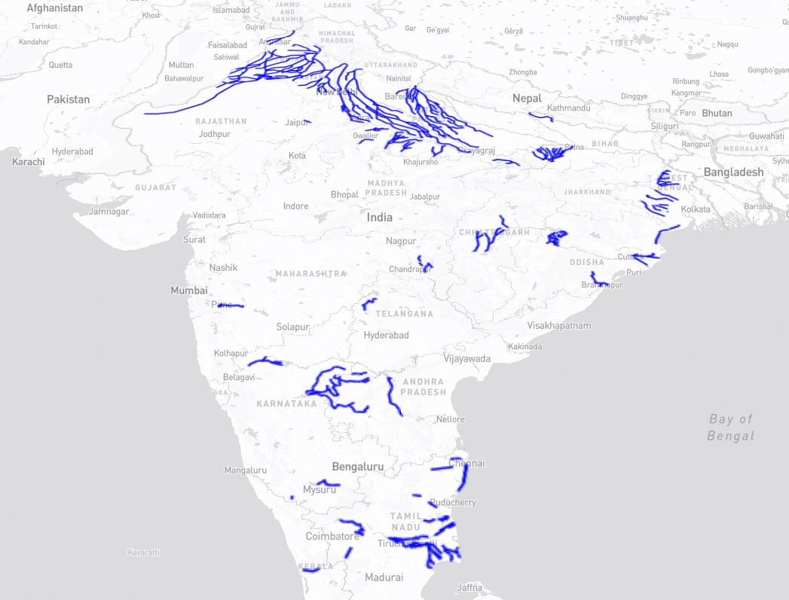

# Mapbox Example Visualisation

This example visualisation has been put together to demonstrate the intended use of the TWA Visualisation Framework (TWA-VF). This framework has been designed to make it easier for users not experienced with Typescript (or the mapping libraries) to quickly & easily put together a new Digital Twin visualisation. It is intended for developers to use this example visualisation to gain an understanding of the TWA-VF before attempting to create their own visualisation; to do that, this example can be copied and used as a starting point.

It is recommended that you read the through the [TWA-VF Overview](../docs/overview.md) and [Working with Mapbox](../docs/mapbox.md) sections of the documentation before playing around with this example.

 

## Sample Data

A small amount of sample data has been committed to demonstrate the power of the TWA-VF to visualise different data types. Please do not make changes to the sample data without consulting the original developer. At the time of writing, the sample data sets include:

- **Cambridge**:
  - Based in and around Cambridge, this data set mimics a single stack that contains data on college locations and buildings.
  - The colleges layer demonstrates how clustering can be achieved.
  - No metadata or time series present in this data set.
- **Singapore**:
  - Based in Singapore, this data set includes details of rail lines and stations.
  - Shows examples of setting up data-driven styling within the `data.json` file.
  - No metadata or time series present in this data set.
- **India**:
  - Based in India, this data set shows rasterised locations of Aqueducts and Canals.
  - This data is pulled from a public WMS endpoint provided by Stanford University.
  - No metadata or time series present in this data set.

In most deployed visualisations, an online stack of microservices will provide data endpoints through which data can be queried/loaded onto the visualisation. In this example, no online stack is used, solely to remove a lengthy prerequisite step. Instead, sample data in local GeoJSON files have been added (to be hosted by the visualisation's web server) and, in one case, a community provided WMS endpoint connected to.

In production, it is advised that all data is loaded into a geospatial data provider (like GeoServer) and a WMS endpoint used; local files can be utilised but then do not offer the optimisation and caching of services like GeoServer. For more information on how to do this, see the README for the [Stack Data Uploader](https://github.com/cambridge-cares/TheWorldAvatar/tree/main/Deploy/stacks/dynamic/stack-data-uploader).

It's also worth noting that with this example visualisation, no stack or FeatureInfoAgent is running, hence there is no support for dynamically loaded meta or time series data. To spin up a full TWA Stack that supports a visualisation and contains the ability to dynamically load meta data, please see the [Mapbox Tutorial](../docs/tutorial-mapbox.md).

 

## Running the visualisation

The `docker-compose.yml` file contains the required configuration to build a Docker image for the example visualisation. This uses the `ghcr.io/cambridge-cares/twa-vf` image as a base then adds the contents of the `webspace` directory to a volume mounted at `/var/www/html` within the container (allowing the built in Apache HTTP server to host those files).

Once the requirements below have been addressed, the example visualisation image can be launched using the `run.sh` script. The `run.sh` script optionally accepts a `TAG=[TAG]` argument that allows the user to specify which version of the TWA-VF base image should be used to run the visualisation; if no tag is passed, then the current contents of the `../library/VERSION` file are used. This may require a copy of the TWA-VF to be built locally or pulled from the registry before running the script.

### Requirements

* Files to be hosted must be contained within the `webspace` directory.
* A valid Mapbox username and API token must be provided.
* A connection to the internet is required to contact remote resources and use the mapping libraries.
* Build the TWA-VF locally or pull a pre-built TWA-VF image from the GitHub registry.

 

## Images

 

 

 <em>Cambridge data set.</em>   

 

 

 <em>India data set.</em>   

 

 

 <em>Singapore data set.</em>   

