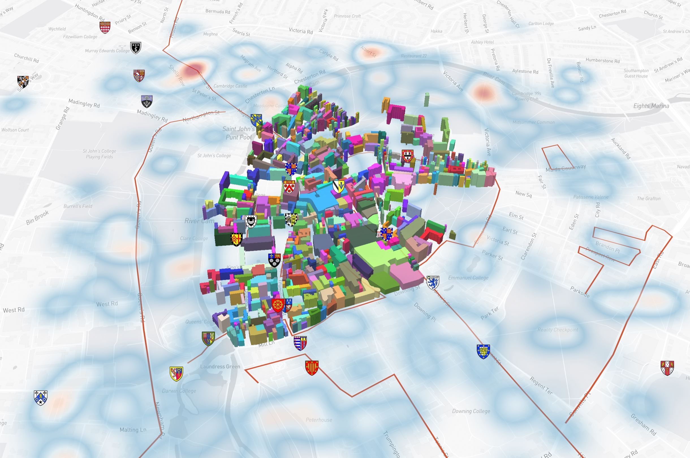

# Example Mapbox visualisation

This example visualisation has been put together to demonstrate the intended use of the TWA Visualisation Framework (TWA-VF). This framework has been designed to make it easier for users not experienced with Typescript (or the mapping libraries) to quickly & easily put together a new Digital Twin visualisation. It is intended for developers to use this example visualisation to gain an understanding of the TWA-VF before attempting to create their own visualisation; to do that, this example can be copied and used as a starting point.

It is recommended that you read the through the [TWA-VF Overview](../docs/overview.md) and [Working with Mapbox](../docs/mapbox.md) sections of the documentation before playing around with this example.

 

## Sample data

A small amount of sample data has been committed to demonstrate the power of the TWA-VF to visualise different data types. Please do not make changes to the sample data without consulting the original developer. At the time of writing, the sample data sets cover the Cambridge area and include:

- **Sample Polygons**:
  - These are loaded from GeoServer as vector data using the Mapbox tiles format.
  - Visualised using the `fill-extrusion` type.
  - Extrusion height is dynamically pulled from the `height` parameter of each feature.
- **Sample Points**:
  - These are loaded from GeoServer as non-tiled GeoJSON data.
  - Data points include `name`, `description`, and `thumbnail` fields.
  - Shows an example of clustering.
- **Sample Lines**:
  - Simple lines, loaded from GeoServer as vector data.
- **Sample Raster**:
  - Sample raster, loaded from GeoServer.
- **Sample Heatmap**:
  - Points loaded as vector from GeoServer.
  - Visualised as a Mapbox heatmap.

In most deployed visualisations, an online stack of microservices will provide data endpoints through which data can be queried/loaded onto the visualisation. In this example, no online stack is used, solely to remove a lengthy prerequisite step. Instead, sample data in local GeoJSON files have been added (to be hosted by the visualisation's web server) and, in one case, a community provided WMS endpoint connected to.

In production, it is advised that all data is loaded into a geospatial data provider (like GeoServer) and a WMS endpoint used; local files can be utilised but then do not offer the optimisation and caching of services like GeoServer. For more information on how to do this, see the README for the [Stack Data Uploader](https://github.com/cambridge-cares/TheWorldAvatar/tree/main/Deploy/stacks/dynamic/stack-data-uploader).

It's also worth noting that with this example visualisation, no triplestore data or FeatureInfoAgent is used, hence there is no support for dynamic metadata and timeseries data is unavailable. This is something that we plan to work on in future.

 

## Images

 

 

 <em>Some sample data sets.</em>   

