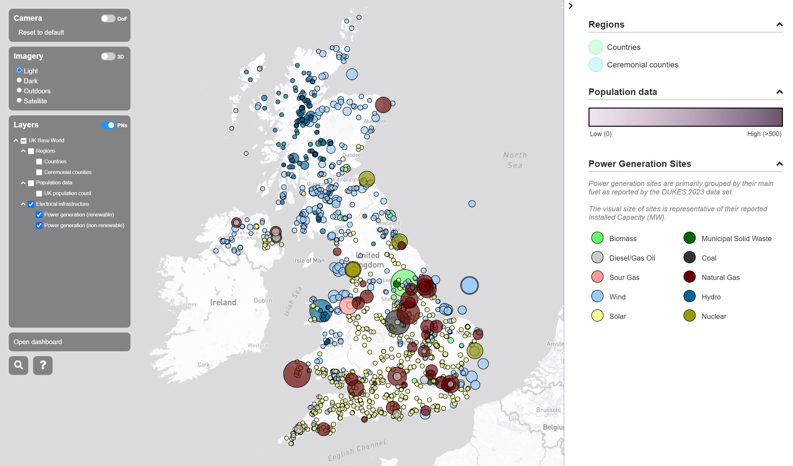

# Visualisation of the UK Base World

This directory contains the documentation, configuration files, and associated scripts for a visualisation of The World Avatar's base world (focussing on assets within the United Kingdom). Whilst other data and capabilities related to the base world may exist elsewhere in The World Avatar, this documentation only covers the steps needed to acquire, upload, and visualise data used in the live UK Base World visualisation currently available from [The World Avatar's website](https://theworldavatar.io).

This documentation was written in August of 2023. The data available from the listed sources may have changed since this time, hopefully the processes are still applicable to any new data sets.

## Gathering data

Data for this visualisation has been gathered from the sources listed on the [Data](./docs/data.md) page; the original raw files, as well as any processed files, have also been archived at CMCL on their Pavilion file server. Hopefully this process is repeatable with future versions of these data sets, if not then the archived data can be used as a fall-back. If the visualisation is updated with future versions of these data, the raw and processed versions of said files should also be archived.

As a base world visualisation, more data sources will be added in future; as and when they are, they should be documented within the aforementioned page.

## Uploading data

Once the correct files for each data source have been acquired, we can spin up an instance of the stack (see [here](https://github.com/cambridge-cares/TheWorldAvatar/tree/main/Deploy/stacks/dynamic/stack-manager) for details on how to do this) then run the data uploader to get our data into a relational database. Before trying to upload data, the [uploader's documentation](https://github.com/cambridge-cares/TheWorldAvatar/tree/main/Deploy/stacks/dynamic/stack-data-uploader) is considered required reading; this file will not detail the generic upload process.

With each data set come a number of pre-written associated files (configurations, queries, styles etc.). These files are documented along with their corresponding data source on the [Data](./docs/data.md) page.

Once the data uploader has finished running, you should be able to log into the GeoServer web dashboard and preview the layers (and feature locations within them).

## Creating a visualisation

A visualisation has also been created for the UK Base World, the `visualisation/webspace` directory contains the files required and are copied into a `twa-vf` container for hosting during the start-up process. As with all TWA-VF visualisations, the `data.json` file defines the data to be loaded on the visualisation, and in what grouping. Users running the visualisation in a new location may need to adjust the URLs listed in this file.

For more information on how visualisations are created and configured using the TWA-VF, please read its [documentation page](https://github.com/cambridge-cares/TheWorldAvatar/tree/main/web/digital-twin-vis-framework).

Note that this __may__ require building a local copy of the `twa-vf` Docker image. If so, please run the `build.sh` script from within the `/web/twa-vis-framework/library` directory.

### Feature info agent

To support metadata for the visualisation, the stack for this visualisation has been configured to also launch an instance of the [Feature Info Agent](https://github.com/cambridge-cares/TheWorldAvatar/tree/main/Agents/FeatureInfoAgent). The appropriate configuration file and query files have been created and will be copied into the relevant directories when using the `./scripts/start.sh` script to launch the stack (see below).

### Grafana dashboard

In addition, this stack will also launch a Grafana container to host associated dashboards. Whilst empty at first, the `./scripts/start.sh` script will upload pre-configured data source and dashboard definitions to provide a number of default analytic dashboards.

## Running the stack

The UK Base World visualisation has been put together as a single stack with no requirements on any external services (outside of standard JavaScript libraries). Both the data required for the visualisation, and the visualisation itself are hosted within the stack instance. For more information on the stack, read the [documentation here](https://github.com/cambridge-cares/TheWorldAvatar/tree/main/Deploy/stacks/dynamic/stack-manager).

For ease of use, a script has been provided to spin up the stack and upload the relevant data, this removes the need for users to manually populate files and directories within the `stack-manager` directory. Note that this script uses standard bash but does **require the installation of the `jq` package** on the host machine to parse JSON responses from the Grafana HTTP API.

Note that this script has been developed assuming a first-time spin up condition, it has not been tested in the case that some containers or volumes already exist; it would likely need temporary, local only changes in that situation.

To run the script and bring up a local instance of the UK Base World visualisation, follow the below steps. To get copies of the required data files, please see the data sections above or contact CMCL for archived copies.

**Note:** running the script to deploy this stack will remove any existing stack manager configurations; please backup any existing ones beforehand.

1. If required, run the `build.sh` script from within the `/web/digital-twin-vis-framework/library` directory.
   - This will build a local copy of the visualisation hosting image, in case the current branch contains a new version that hasn't been pushed yet.
2. Navigate to the `uk-base-world` directory.
3. Add your Mapbox credentials:
   - Add your username to a file at `./visualisation/mapbox_username`
   - Add your API key to a file at `./visualisation/mapbox_api_key`
4. Add the data files: 
   - Add the correct files according to the [data documentation](./docs/data.md).
5. Run the script from the `uk-base-world` directory, passing a password for PostGIS and GeoServer.
   - Example command: `./scripts/start.sh PASSWORD=pickapassword`
   - If deploying behind an existing URL, the `HOST` parameter can be passed to auto-update the visualisation's client side files (e.g. `./scripts/start.sh PASSWORD=pickapassword HOST=https://theworldavatar.io/demo/uk-base-world`)
6. Confirm that the required data files are present by pressing the `Y` key.
7. Once prompted, wait for the stack to spin up, the data uploader should run automatically a few seconds after the manager has exited.
   - That stack is considered "spun up" once the stack-manager container has stopped (although there is some wiggle-room here if you're also spinning up containers that have lengthy service start-ups).
   - If running for the first time, this may take a while as Docker images will need to be downloaded.
8. Confirm the visualisation is working by visiting `localhost:38383/visualisation`

Stopping the stack (including the option to remove existing volumes), can be done by using the `stack.sh` script within the `scripts` directory; the name of the created stack will be `UKBASEWORLD`.

## Support

For any support in reproducing this visualisation, please contact the CMCL support team.

## Screenshot

    

    <em>UK Base World visualisation, circa August 2023.</em>

