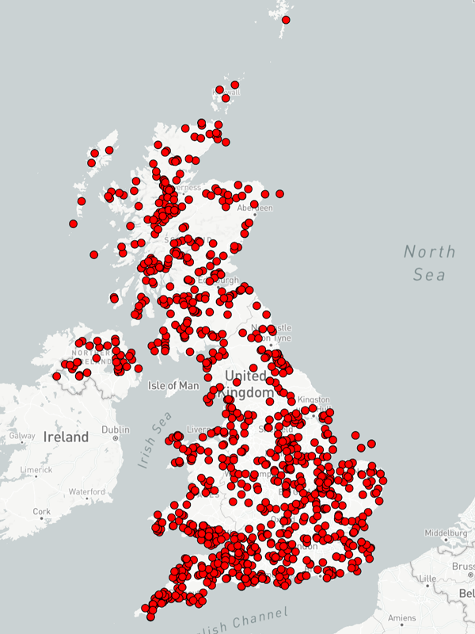
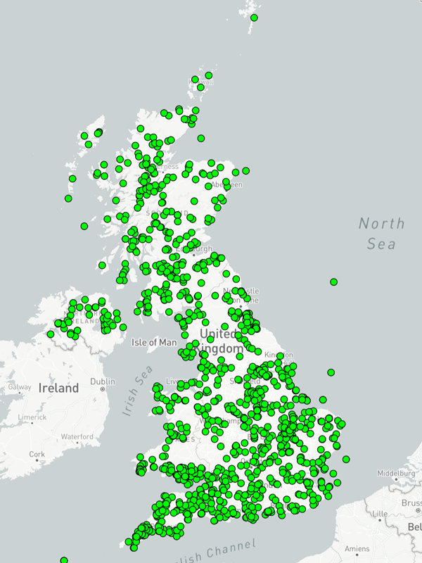
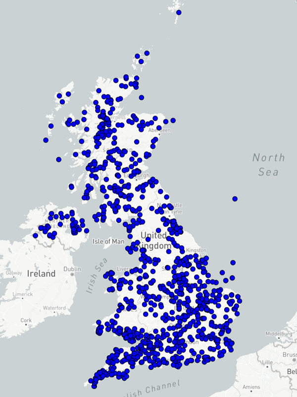

# Visualisation of the UK's Power System

<!--
    In a later phase of this visualisation, we will add data on power generation sites pulled from the Renewable Energy Planning Database (REPD). For now, information relating to this data source has been commented out.
-->

This directory contains the documentation, configuration files, and associated scripts for the visualisation of the UK's Power System. Whilst other data and capabilities related to the UK's power system may exist elsewhere in The World Avatar, this directory only covers the steps needed to acquire, upload, and visualise data on the UK Power System visualisation currently hosted on The World Avatar's website (theworldavatar.io).

This documentation was written in July of 2023. The data available from the listed sources may have changed since this time, hopefully the documented processes are still applicable to the new

## Gathering data

Data for this visualisation has been gathered from the below sources; the original raw files and the processed files have been archived at CMCL on their Pavilion file server.

Hopefully this process is repeatable with future versions of these data sets, if not then the archived data can be used as a fall-back. If the visualisation is updated with future versions of these data, the raw and processed versions of said files should also be archived.

It should be noted that these two data sets do contain overlapping data, something that will be addressed in later steps.

**Digest of UK Energy Statistics:** 

Once a year, the UK government publishes a Digest of UK Energy Statistics (DUKES);  note this was formally published by the Department for Business, Energy and Industrial Strategy (BEIS) before it was dissolved, subsequent publications should be from the new Department for Energy Security and Net Zero (DESNZ).

Unfortunately we've discovered a number of issues with the 2022 data set (the latest available at the time of writing). These include:

* No confirmation of the project used (we assume `EPSG:27700`)
* Locations do not match satellite images from Google Maps
  * In most cases, the locations given in the data are offset by about 0.5km to 1.5km
  * In other cases locations are listed as in one country, but the given coordinates are in another
* Provided OS grid references do not match the Easting/Northing given for the same plant 

Ideally, we'd revert to using an older set of the DUKES data. Unfortunately (again), 2022 is the first year that the DUKES data has contained locations for each plant. However, for the 2019 dataset (which was published with no locations), someone did go through and manually add Latitude and Longitudes for the listed plants by manually searching for them in Google Maps.

In an attempt to provide the most up-to-date set of data (something we could arguably refer to as an "adjusted DUKES 2022" dataset), Michael at CMCL has done the following:

* Where an exact match on the `Site Name` column exists, use the location from the 2019 dataset and all other columns from the 2022 data
* Where no exact match exists, do a [fuzzy match](https://www.datamatchingworks.com/record_linkage/) to find sites where the names are very similar between 2022 and 2019 sets
  * These were then manually reviewed, and if determined that the sites were the same, then the 2019 locations are used with other data from the 2022 set
* Any left over 2022 sites that do have locations get them converted to `EPSG:4326` (e.g. Latitude, Longitude)
* Any 2022 sites that had no locations listed, and no matching 2019 site could be found, are removed
* Any clear duplicates were removed
* Sites listed in one county but with locations shown clearly in other countries were:
  * Updated to the correct location if found in the original 2019 or 2022 data sets
  * Updated to the correct location if it could be found on Google Maps
  * Otherwise removed 

This leaves us with a list of `1157` sites, down from the `1313` sites listed in the original 2022 data set. The CSV file resulting from this process can be found on CMCL's `Pavilion` server; please get in touch with their support team if you require a copy.

<table width="50%" style="display: block; margin-left: auto; margin-right: auto;">
    <tr>
        <td width="33%" style="text-align: center;">
            </img> 
            <i>2019 dataset</i>
        </td>
         <td width="33%" style="text-align: center;">
            </img> 
            <i>2022 dataset</i>
        </td>
         <td width="33%" style="text-align: center;">
            </img> 
            <i>Merged dataset</i>
        </td>
    </tr>
</table>

## Uploading data

Now that we have a clean CSV for the data, we can spin up an instance of the stack (see [here](https://github.com/cambridge-cares/TheWorldAvatar/tree/main/Deploy/stacks/dynamic/stack-manager) for details on how to do this) then run the data uploader to get our data into a relational database. Before trying to upload data, it is required to read the [uploader's documentation](https://github.com/cambridge-cares/TheWorldAvatar/tree/main/Deploy/stacks/dynamic/stack-data-uploader); this file will not detail the generic upload process.

Note that the configurations below have been put together with the aim of uploading the 2019, 2022, and 2019-2022 merged data sets as three separate tables. Whilst the latter of these three will be used in the visualisation, having the ability to update the configuration and use the original (perhaps lower-quality) data could be quite useful.

Copies of the uploader configuration, Ontop mapping, and ontology files are listed below.

* [Stack uploader config](./resources/uk_power.json)
* [Ontop mapping for DUKES data](./resources/uk_power_dukes.odba)
  * Note that at the time of writing, this mapping utilises TBoxes that do not appear within the OntoEIP ontology. Nothing in the mapping contradicts the ontology, but the existing ontology does not contain enough concepts to cover all of the data provided by DUKES. 
* [OntoEIP ontology](https://github.com/cambridge-cares/TheWorldAvatar/tree/main/JPS_Ontology/ontology/ontoeip)
  * Note that when uploading the ontology files, you will need to rename any Turtle files with the `.ttl` extension. The stack data uploader assumes that `.owl` files are using the XML format, if an `.owl` file is using Turtle then this will cause errors during upload.

## Creating a visualisation

### Loading sources

### Loading layers

## Support

For any support in reproducing this visualisation, please contact 